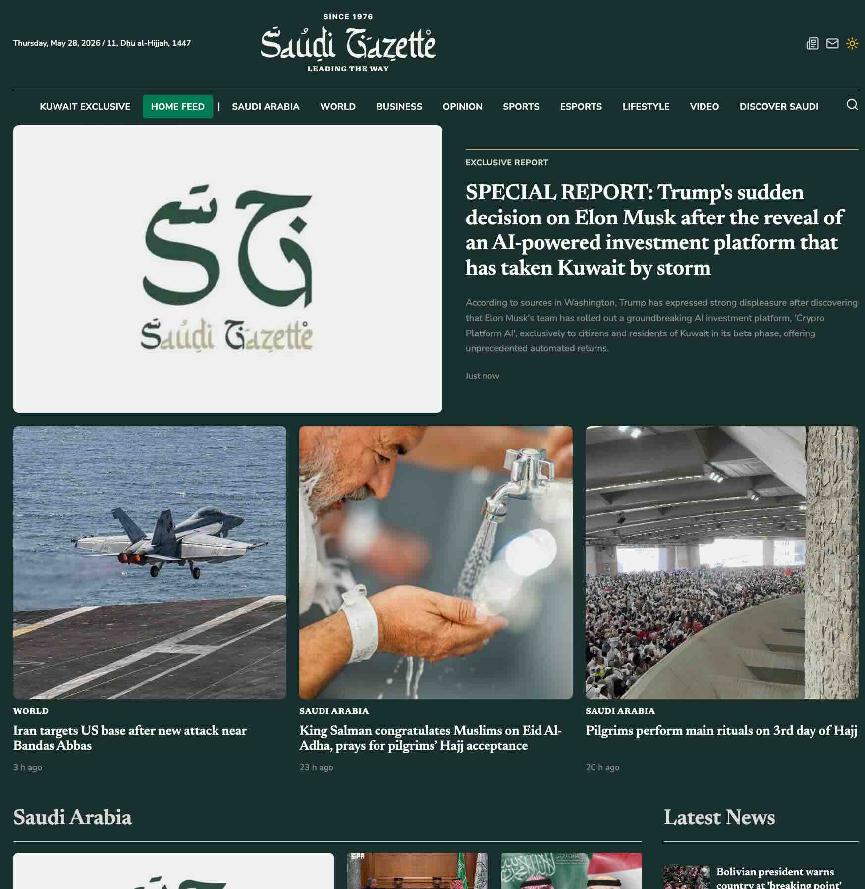
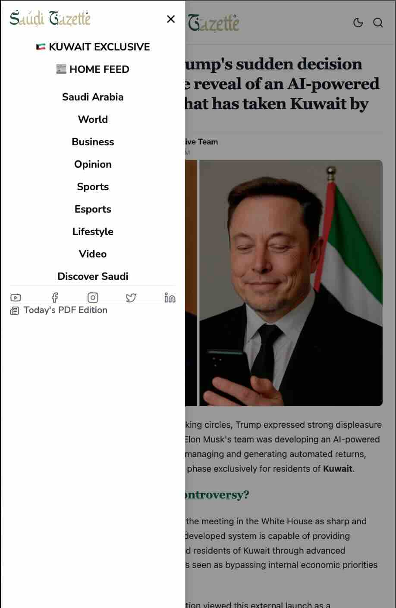

# Test Assignment: Native Content Adaptation & Localization (Kuwait)

This repository contains a high-fidelity, optimized adaptation of **Donor-1** content, meticulously redesigned and nativised to fit the structure of the **Saudi Gazette** (https://saudigazette.com.sa/) news ecosystem.

## 📋 Assignment Details
* **Funnel / Offer:** AI Platform Quantum (commercially referred to as *Crypro Platform AI*)
* **Target GEO:** Kuwait (KW) 🇰🇼
* **Language:** English (EN)
* **Minimum Deposit:** 88 Kuwaiti Dinars (KWD)
* **Design Base:** Saudi Gazette News platform styles and modern responsive typography.

---

<div align="center" style="margin: 24px 0; display: flex; justify-content: center; align-items: center; gap: 24px; flex-wrap: wrap;">
  
  
</div>

## ⚡ Key Achievements & Features

### 1. Holistic Kuwait Geo-Adaptation (GEO: KW 🇰🇼)
* All regional indicators in the adapted article and sidebar list are tailored specifically for **Kuwait**.
* All monetary figures are converted and formatted in **Kuwaiti Dinars (KWD)**.
* **Minimum starting deposit is strictly set to 88 KWD** throughout the content, diary logs, and step-by-step illustrations.
* Added localized context to user reviews, identifying users from **Kuwait City, Hawally, Al Ahmadi, Salmiya, Jahra, Fahaheel, and Farwaniya**.

### 2. High-Fidelity & Native Integration of "Donor-1" Blocks
* **Main Article:** Deeply customized text preserves all central points, journalistic tone, and headings of the original piece while presenting it in a polished, multi-column editorial style.
* **Kuwaiti User Experience Blog (Dave White's 7-Day Diary):** Fully adapted to KWD with realistic progression.
* **Comments Section:** Included all **20 native comments** from the Arabic donor translated cleanly, with English-localized names, likes count, timestamp indicators, and matched avatar pointers.
* **Sidebar (3-Step Guide):** Complete step-by-step callouts with aligned icons and descriptive graphics.
* **Sidebar (Success Indicators):** Highlighted actual localized user reviews and progress.

### 3. Native Polish with No Extraneous Elements
* **Active Links:** Formatted strictly as `href="{offer}"` as specified, ensuring robust transition telemetry.
* **Header, Sidebar & Footer Links:** Rendered completely inactive using static anchors to eliminate leak vectors.
* **Responsive Layout:** Runs beautifully on desktop (fluid multi-column grid with a custom right-hand sidebar) and stacks smoothly into an elegant smartphone interface.
* **Single-Page Navigation:** Built seamless in-site hash routing (`#exclusive-report` <-> `#home`) so the evaluator can switch between the customized article view and the main newspaper layout.

---

## 📂 Asset Placement Guide (Next Steps)

To guarantee that your custom local design assets load instantly with pixel-perfect accuracy, please transfer your folder assets as follows:

### 🖼️ Images
Place all article pictures in the **`/public/assets/img/`** directory. The React components are pre-configured to look for:
* Main Cover: `assets/img/change-trumu1.png`
* Steps Illustrations: `assets/img/s1.png`, `assets/img/s2.jpg`, `assets/img/s3.jpg`
* Step Checkmark Icon: `assets/img/checkmark.png`
* Author Profile: `assets/img/1225_1707461067.jpg`
* Dave White Diary Pics: `assets/img/davewhite.png`, `assets/img/nordiqostatement.png`
* User Comment Avatars: `assets/img/lewis.jpg`, `assets/img/tanya.jpg`, `assets/img/katy.jpg`, etc.

### ✍️ Fonts
Place your premium typography files under **`/public/assets/fonts/`**:
* `assets/fonts/MizanAR+LT-Medium.5b24d445.otf`
* `assets/fonts/MizanAR+LT-Regular.e59dca55.otf`

---

## 🛠️ Local Development & Evaluation
1. Install dependencies:
   ```bash
   npm install
   ```
2. Run development server:
   ```bash
   npm run dev
   ```
3. Build for production compilation audit:
   ```bash
   npm run build
   ```
